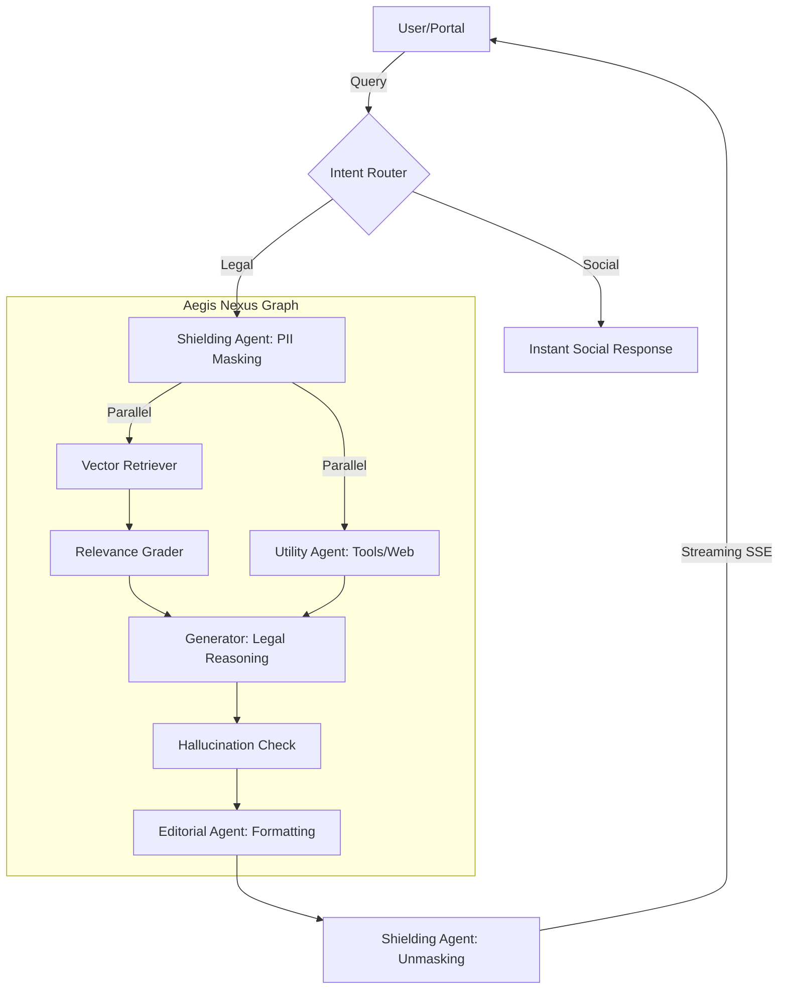

# 🏛️ Aegis Genesis (v1.0.0)
### *Premium Legal Intelligence & Intellectual Workspace*

Aegis is an enterprise-grade AI Legal Engine designed for high-concurrency research, document analysis, and automated legal reasoning. Built on an asynchronous, multi-agent architecture, it combines the privacy of a local vault with the power of live web intelligence.

---

## 🌟 Core Pillars
*   **The Nexus Engine**: A multi-agent LangGraph architecture featuring specialized nodes for **Shielding**, **Retrieval**, **Utility**, and **Editorial Polishing**.
*   **Privacy-First Design**: Native PII/PHI masking (The Shielding Agent) ensures that sensitive case data never reaches the LLM in its raw form.
*   **Aegis Portal V2**: An ultra-lightweight, high-performance Vanilla JS workspace that delivers token-by-token streaming with sub-200ms latency.
*   **Verified Intelligence**: Hallucination detection and relevance grading are baked into every research cycle.

---

## 🏗️ Technical Architecture


---

## 🛠️ Tech Stack
*   **Backend**: Python 3.11+, FastAPI (Async/Streaming), LangGraph, LangChain.
*   **Intelligence**: Groq (Llama-3.3 70B & 8B), Cohere Embeddings.
*   **Database**: Supabase (pgvector), PostgreSQL.
*   **Frontend**: Vanilla JavaScript (ES6+), Tailwind CSS, Material Icons.
*   **DevOps**: Docker, Docker-Compose, GitHub Actions.

---

## 🚀 Quick Start (Production)

### 1. Environment Configuration
Create a `secrets.txt` (or `.env`) with the following:
```bash
GROQ_API_KEY=your_key
SUPABASE_URL=your_url
SUPABASE_SERVICE_KEY=your_key
TAVILY_API_KEY=your_key (optional for web search)
```

### 2. Launching with Docker
```bash
docker-compose up --build -d
```
The portal will be available at: `http://localhost:8000/portal`

---

## 🧪 Industry Standard Testing (CI)
Aegis includes a comprehensive test suite covering Auth, RAG accuracy, and Agent concurrency.
```bash
pytest engine/tests/test_production.py
```

---

## 🛡️ License & Safety
Aegis is built for **Professional Use**. Always verify AI-generated insights against primary legal sources.
*   **Version**: 1.0.0 (Genesis)
*   **Build Status**: Passing (Aegis-v2)
